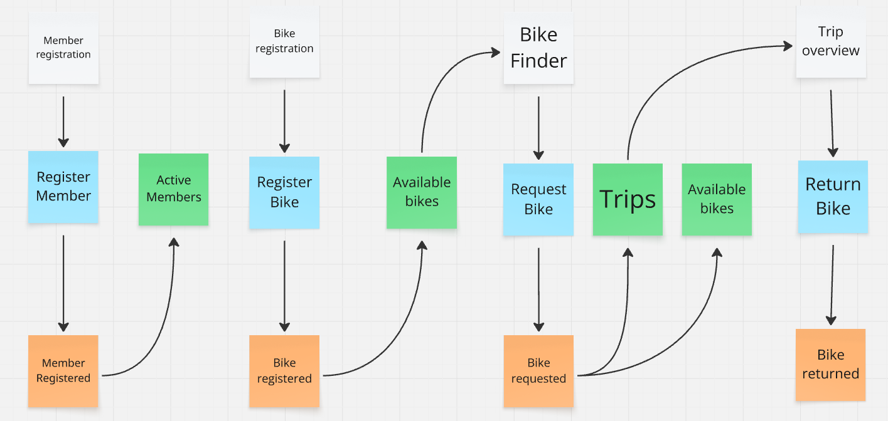
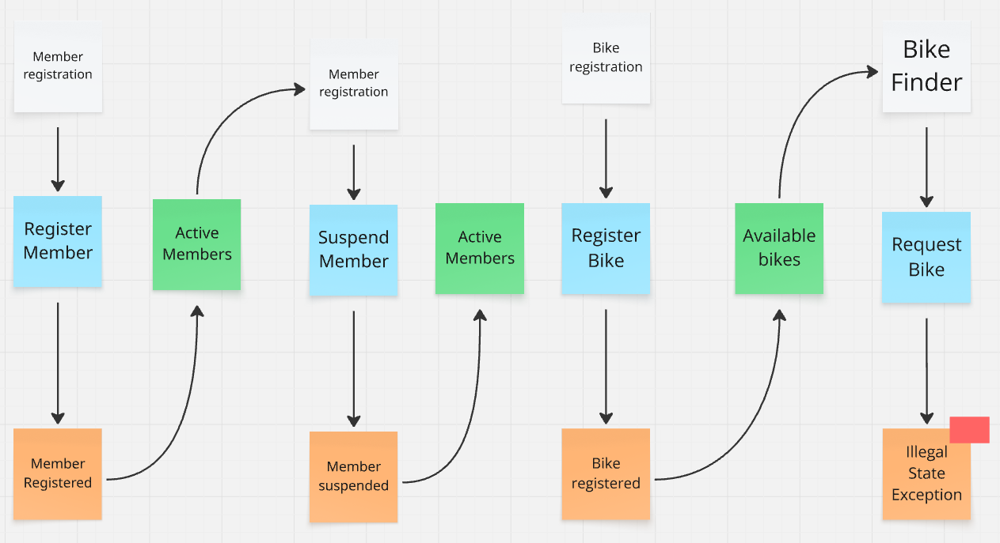
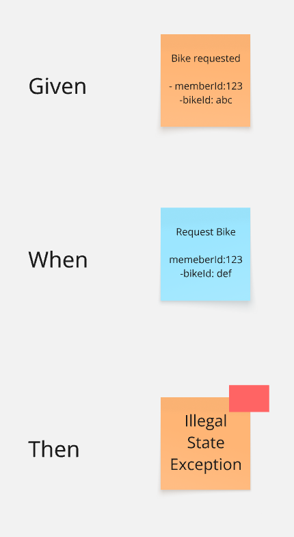

# Training Exercises

These exercises extend the bike-rental baseline so you touch every part of an Axon CQRS /
event-sourced application: the write model (commands, event-sourced entities, DCB), events, and the
read model (projections, queries).

Exercises 1–3 ship with a **failing test that is the specification**. Your job is to make it pass by
filling in the `// TODO (Exercise N)` markers in the source.

Exercise 4 is different: there is **no scaffolding** — no TODO markers, no command/event/query classes,
no test. You get the requirement and nothing else. Design the messages, the handlers, any read model,
the REST endpoint, and the test that proves it, all yourself.

The exercises will fully implement the following event model:

Normal flow:


Suspended member can't request a bike:


Do them in order — 2 evolves the events that 3 reads, 1 adds an event that 3 reads, and 4 builds on all
three.

Run one exercise's test at a time, e.g.:

```bash
./gradlew test --tests "*.TripCommandHandlerTest"
./gradlew test --tests "*.RequestBikeMembershipTest"
./gradlew test --tests "*.RentalHistoryProjectionTest"
```

The starting state: `RentalControllerTest` passes and so do the request-bike tests in
`TripCommandHandlerTest`; the exercise specs (the return-bike tests in `TripCommandHandlerTest`,
plus `RequestBikeMembershipTest` and `RentalHistoryProjectionTest`) fail — except the one happy-path
membership case, which already passes.

---

## Exercise 1 — Return a bike

**Concept:** a second command on an existing entity, a real state transition, and updating a projection
on a new event.

**Spec:** the return-bike tests in `TripCommandHandlerTest`

**Implement:**
- `write/reservation/TripCommandHandler` — complete the `ReturnBike` handler: append `BikeReturned`
  when the bike is rented, otherwise throw `IllegalStateException("Bike is not currently rented")`.
- `write/reservation/BikeState` — add an `@EventSourcingHandler` for `BikeReturned` so the bike is
  available again.
- `query/availablebikes/AvailableBikesProjection` — handle `BikeReturned` to flip the read model back
  to available.

**Provided:** `ReturnBike` command, `BikeReturned` event, a `/return` REST endpoint.

---

## Exercise 2 — Members and the Dynamic Consistency Boundary

**Concept:** a second event-sourced entity, and a single command handler that sources **two** entities
(the bike *and* the member) to make one decision — the AF5 DCB pattern.

**Spec:** `RequestBikeMembershipTest`

**Implement:**
- `write/membership/MemberState` — the two `@EventSourcingHandler` methods so `isActive()` is true only
  for a registered, non-suspended member.
- `write/reservation/TripCommandHandler` — inject the member with
  `@InjectEntity(idProperty = "memberId") MemberState memberState` alongside the existing bike, and
  reject inactive members with `IllegalStateException("Member is not active")`.

**Provided:** the full `Member` command/event API, a working `MemberRegistration` handler, and
`/members` + `/members/suspend` endpoints. `RequestBike`/`BikeRequested` already carry `memberId`.

---

## Exercise 3 — Rental history read model

**Concept:** a second, independent projection off the same event stream, with its own JPA read model
and query — a different question needs a different read model.

**Spec:** `RentalHistoryProjectionTest`

**Implement:** the `RentalHistoryProjection` is empty — write it from scratch.
- `query/rentalhistory/RentalHistoryProjection` — an `@EventHandler` that records a rental on
  `BikeRequested`, an `@EventHandler` that marks it returned on `BikeReturned`, and a `@QueryHandler`
  for `FindRentalHistory`.
- `query/rentalhistory/RentalRecordRepository` — add the finder(s) your handlers need (e.g. locate the
  still-open rental for a bike). It starts with just `findByMemberId`.

**Provided:** `RentalRecord` entity, a `RentalRecordRepository` with `findByMemberId`, the
`FindRentalHistory` query, and a `/members/{memberId}/rentals` endpoint.

> Depends on the `memberId` from Exercise 2 and the `BikeReturned` event from Exercise 1.

---

## Exercise 4 — One bike per member

**Concept:** enforcing a business rule that spans a member's whole rental lifecycle.

**The requirement:**

> A member may hold only one bike at a time. While a member has a bike out, any further `RequestBike`
> for that member is rejected with `IllegalStateException("Member already has a bike")`. Once the bike
> is returned, the member can request again.



That is the whole exercise. There are no TODO markers, no new classes, and no test provided — write
the test that pins down this rule yourself, and don't break the tests that already pass. Do it after
Exercises 1–3.
